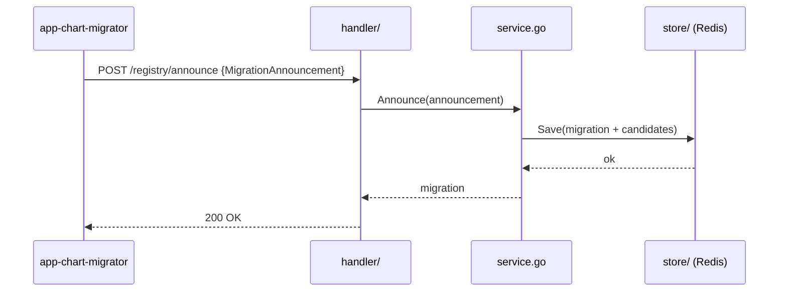
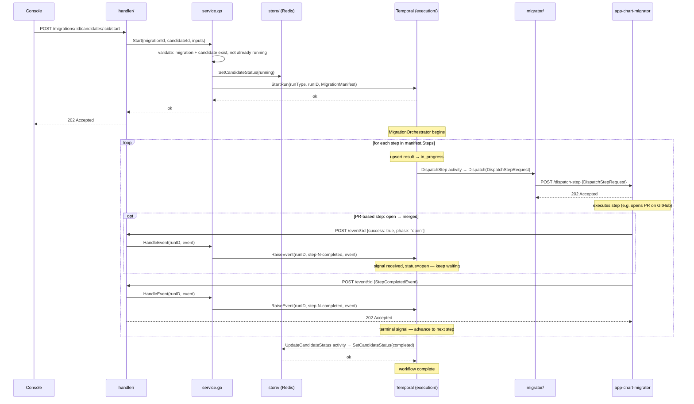
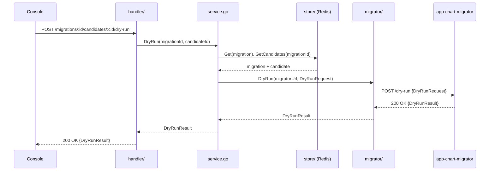
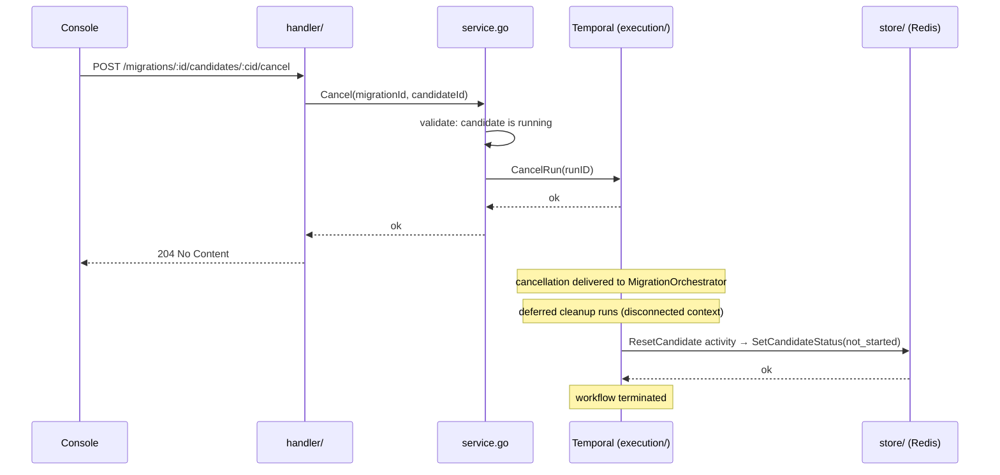
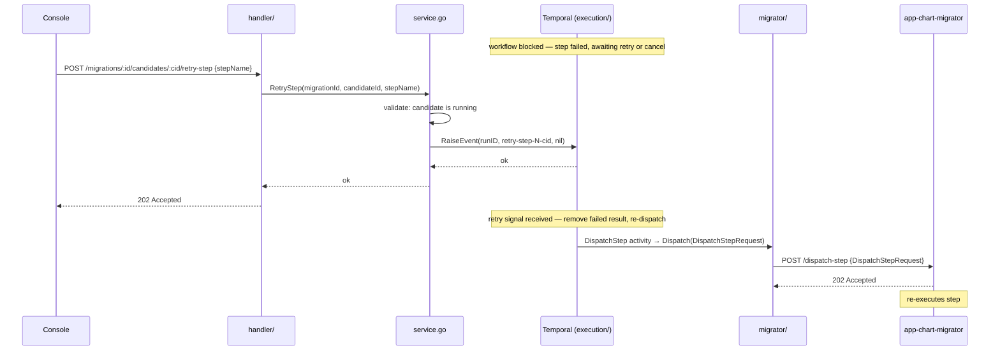

# Loom — Key Operation Flows

Sequence diagrams for the main operations in Loom.

**Common participants:**

| Alias | Component | Role |
|---|---|---|
| `Con` | loom-console | Operator UI |
| `H` | handler/ | Gin route handlers |
| `S` | service.go | Use-case orchestration + business rules |
| `St` | store/ (Redis) | State persistence via `MigrationStore` port |
| `E` | execution/ + Temporal | Durable workflow engine via `ExecutionEngine` port |
| `M` | migrator/ | Outbound HTTP via `MigratorNotifier` / `DryRunner` ports |
| `W` | app-chart-migrator | External migrator service |

---

## 1. Announce

A migrator POSTs its migration definition and base URL on startup. After this the server knows which steps exist, who the candidates are, and the URL to dispatch steps to.

`migratorUrl` from the announcement is stored inside the `Migration` document in Redis and threaded through to every `DispatchStepRequest` — no separate in-memory registry is needed.

---

## 2. Run lifecycle

The operator starts a candidate. The server validates, sets the candidate to `running`, starts a durable Temporal workflow, then immediately returns `202 Accepted`. Everything after that is asynchronous.

The workflow sequences each step in turn: it dispatches outbound to the migrator, then blocks waiting for a completion signal sent via the migrator's callback to `POST /event/:id`. Steps can go through intermediate states (`open`, `awaiting_review`) before reaching a terminal state (`completed`, `merged`, `failed`).

---

## 3. Dry run

The operator previews what a run would do for a specific candidate without making real changes. The call is fully synchronous — the console blocks until the migrator returns the diff.

---

## 4. Cancel

The operator cancels a running candidate. The server signals Temporal to cancel the workflow, then returns immediately. The workflow handles cancellation via a deferred cleanup that resets the candidate to `not_started` using a disconnected context — this ensures the cleanup activity runs even after the main workflow context is cancelled.

---

## 5. Step retry

A step has failed. The workflow blocks in `awaitRetryOrCancel`, waiting for either a retry signal or a cancel. The operator clicks Retry, which raises a signal into the running workflow. The workflow removes the failed result and re-dispatches the same step from scratch.

